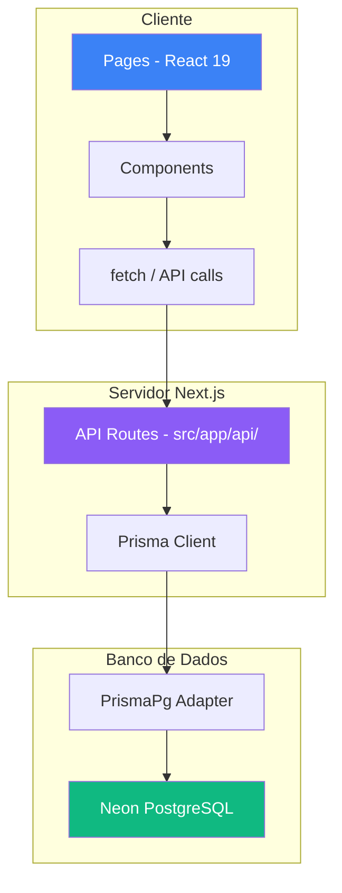
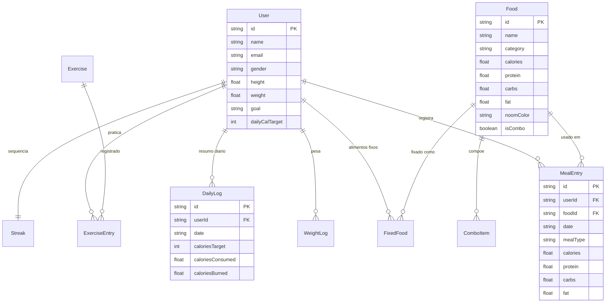
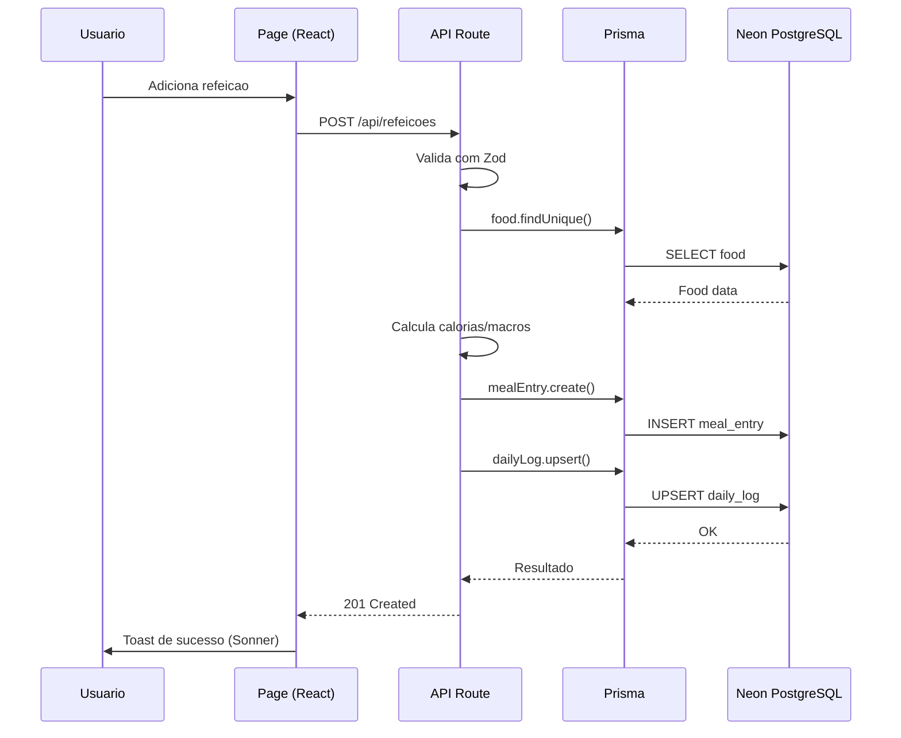

# CalorieTracker - Arquitetura

## Stack Tecnologica

| Camada | Tecnologia | Versao |
|--------|-----------|--------|
| Framework | Next.js (App Router) | 16 |
| UI | React | 19 |
| Linguagem | TypeScript | 5 |
| Estilizacao | Tailwind CSS | 4 |
| ORM | Prisma (com PrismaPg adapter) | 7 |
| Banco de Dados | PostgreSQL (Neon serverless) | - |
| Graficos | Recharts | 3 |
| Notificacoes | Sonner | 2 |
| Icones | Lucide React | 1.7 |
| Validacao | Zod | 4 |
| E-mail | Resend | 6 |
| CSS Utilities | clsx + tailwind-merge | - |

## Visao Geral da Arquitetura

Monolito fullstack com **Next.js App Router**. O frontend e o backend vivem no mesmo projeto, com Server Components e API Routes.



## Estrutura de Diretorios

```
calorietracker/
├── prisma/
│   ├── schema.prisma          # Modelos do banco (10 models)
│   └── seed.ts                # Seed: alimentos + exercicios base
├── src/
│   ├── app/
│   │   ├── (app)/             # Grupo de rotas com layout compartilhado
│   │   │   ├── layout.tsx     # Layout com BottomNav (navegacao inferior)
│   │   │   ├── inicio/        # Dashboard principal
│   │   │   ├── adicionar/     # Adicionar refeicao
│   │   │   ├── diario/        # Diario alimentar
│   │   │   ├── dieta/         # Plano de dieta
│   │   │   ├── exercicios/    # Registro de exercicios
│   │   │   ├── combos/        # Combos de alimentos
│   │   │   └── perfil/        # Perfil do usuario
│   │   ├── api/               # 14 endpoints REST
│   │   │   ├── alimentos/     # CRUD alimentos + busca
│   │   │   ├── base-alimentar/# Base de alimentos pre-cadastrados
│   │   │   ├── combos/        # CRUD combos (refeicoes compostas)
│   │   │   ├── dashboard/     # Dados agregados do dashboard
│   │   │   ├── dieta/         # Plano alimentar e metas
│   │   │   ├── exercicios/    # CRUD exercicios + entradas
│   │   │   ├── perfil/        # Dados do usuario
│   │   │   ├── peso/          # Registro de peso (WeightLog)
│   │   │   ├── projecao/      # Projecao de peso futuro
│   │   │   ├── refeicoes/     # CRUD MealEntry
│   │   │   └── streak/        # Streak de dias consecutivos
│   │   ├── onboarding/        # Fluxo de cadastro inicial
│   │   ├── layout.tsx         # Layout raiz (Sonner, fonts)
│   │   ├── page.tsx           # Pagina raiz (redirect)
│   │   └── globals.css        # Estilos globais (Tailwind)
│   └── generated/
│       └── prisma/            # Prisma Client gerado
├── package.json
├── prisma.config.ts           # Config Prisma CLI (adapter)
├── vercel.json                # Config de deploy Vercel
└── next.config.ts
```

## Frontend

### Grupo de Rotas `(app)/`

As paginas principais da aplicacao ficam dentro do grupo `(app)/`, que compartilha um **layout com BottomNav** (navegacao inferior estilo mobile-first). As paginas incluem:

- **`inicio/`** - Dashboard com resumo calorico do dia, macros, progresso
- **`adicionar/`** - Busca e adiciona alimentos a refeicoes
- **`diario/`** - Visualizacao do diario alimentar por dia
- **`dieta/`** - Configuracao de metas e plano alimentar
- **`exercicios/`** - Registro e historico de exercicios fisicos
- **`combos/`** - Criacao de combos (refeicoes compostas com varios ingredientes)
- **`perfil/`** - Dados pessoais, metas e configuracoes

### Paginas Raiz

- **`page.tsx`** - Pagina inicial (redireciona para `/inicio` ou `/onboarding`)
- **`onboarding/`** - Fluxo de cadastro inicial (nome, peso, altura, meta, etc.)

### Padroes do Frontend

- **Sonner** para notificacoes toast (substituiu o `toast` depreciado do shadcn)
- **Recharts** para graficos de peso e projecoes
- **Lucide React** para icones consistentes
- **Tailwind CSS 4** com `clsx` + `tailwind-merge` para composicao de classes
- **Forms controlados** com estado React (sem lib de forms externa)

## Backend - API Routes

Os 14 endpoints REST ficam em `src/app/api/` e seguem o padrao Next.js App Router (`route.ts` com handlers `GET`, `POST`, `PUT`, `DELETE`).

| Endpoint | Metodos | Descricao |
|----------|---------|-----------|
| `/api/alimentos` | GET, POST | Busca e criacao de alimentos |
| `/api/base-alimentar` | GET | Lista base de alimentos pre-cadastrados |
| `/api/combos` | GET, POST, PUT, DELETE | CRUD de combos (refeicoes compostas) |
| `/api/dashboard` | GET | Dados agregados para o dashboard |
| `/api/dieta` | GET, PUT | Plano alimentar e metas de macros |
| `/api/exercicios` | GET, POST, DELETE | Exercicios e entradas de exercicios |
| `/api/perfil` | GET, PUT | Perfil do usuario |
| `/api/peso` | GET, POST | Registro e historico de peso |
| `/api/projecao` | GET | Projecao de peso baseada em tendencias |
| `/api/refeicoes` | GET, POST, DELETE | CRUD de entradas de refeicao (MealEntry) |
| `/api/streak` | GET, POST | Streak de dias consecutivos logados |

### Validacao

Todas as rotas POST/PUT usam **Zod** para validacao de entrada no backend. Erros de validacao retornam `400` com detalhes estruturados.

## Banco de Dados

### PostgreSQL via Neon Serverless

O banco roda no **Neon** (PostgreSQL serverless com cold-start automatico). A conexao usa o driver `pg` com o adapter `PrismaPg` do Prisma 7:

```typescript
import { Pool } from 'pg'
import { PrismaPg } from '@prisma/adapter-pg'
import { PrismaClient } from '@/generated/prisma/client'

const pool = new Pool({ connectionString: process.env.DATABASE_URL })
const adapter = new PrismaPg(pool)
const prisma = new PrismaClient({ adapter })
```

### Modelos (10 tabelas)



### Padrao de Dados: Denormalizacao para Leitura Rapida

O modelo **MealEntry** armazena `calories`, `protein`, `carbs` e `fat` diretamente (denormalizados), calculados no momento da insercao com base no `Food` e `servings`. Isso evita JOINs e recalculos na leitura.

O **DailyLog** agrega os totais do dia (calorias consumidas, queimadas, macros) e e recalculado automaticamente quando refeicoes ou exercicios sao adicionados/removidos.

### Classificacao Noom

Cada alimento recebe uma cor baseada na densidade calorica (calorias por grama):

- **Verde** (`green`): < 1.0 cal/g - baixa densidade (frutas, legumes, etc.)
- **Amarelo** (`yellow`): 1.0 - 2.4 cal/g - densidade media (graos, carnes magras, etc.)
- **Laranja** (`orange`): > 2.4 cal/g - alta densidade (oleos, doces, etc.)

## Autenticacao

A aplicacao opera em modo **single-user** (sem autenticacao). O `userId` e detectado automaticamente (primeiro usuario no banco ou criado durante o onboarding). Nao ha login, sessoes ou tokens.

## Fluxo de Dados


